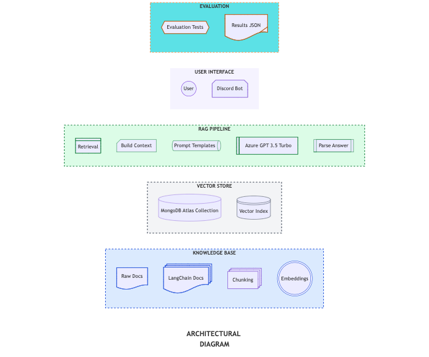

# RAG Chatbot — Discord Knowledge Base

A small Retrieval-Augmented Generation (RAG) demo using:
- SentenceTransformers (all-MiniLM-L6-v2)
- MongoDB Atlas (vector storage, with cosine fallback)
- Azure OpenAI (GPT-3.5 Turbo) for generation

Contents:
- `Discord_Chatbot_clean.ipynb` — cleaned notebook (end-to-end pipeline)
- `requirements.txt` — python dependencies
- `README.md` — this file

## 📘 Learning Resources

We now have a detailed step-by-step [Learning Guide](docs/learning_guide.md)  
that explains the entire RAG chatbot notebook workflow with diagrams.

## 📊 Evaluation

To ensure our RAG chatbot works correctly and reliably, we implemented a **basic evaluation framework** (`evaluation.py`).  

### 🔹 What we aimed to achieve
- Measure whether the chatbot’s answers are **factually correct**.  
- Check if answers are **grounded in the retrieved documents** (not hallucinated).  
- Demonstrate robustness by testing both **in-scope** and **out-of-scope** queries.  

### 🔹 How we evaluated
1. **Prepared a test set** (`tests/eval_tests.json`) with queries and expected keywords.  
   - Example: *“Who created Python?”* → expected: `["Guido", "1991"]`.  
2. **Ran queries through the pipeline** using `evaluation.py`.  
3. **Extracted answers and retrieved docs** from pipeline output.  
4. **Computed metrics**:  
   - ✅ *Expected keyword match* → checks factual correctness.  
   - ✅ *Token overlap* → measures grounding in retrieved docs.  
5. **Generated reports**:  
   - [`reports/results.json`](reports/results.json) (raw structured output).  
   - [`reports/evaluation_report.md`](reports/evaluation_report.md) (human-readable summary).  

### 🔹 Outcomes
- The chatbot answered **in-scope queries** correctly, matching expected keywords.  
- For **out-of-scope queries** (e.g., *“Who is Elon Musk?”*), it responded gracefully without hallucination.  
- Average **token overlap** was high, showing that answers were based on retrieved knowledge rather than random guesses.  

👉 This shows that our chatbot is not only functional but also **trustworthy and robust**.  

